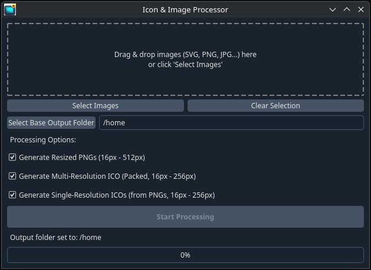

# Iconize Pro

Iconize Pro is a versatile desktop application designed for developers and designers to easily generate application icons in various required formats and sizes from source images. It supports multiple input formats, including SVG, and creates resized PNGs, multi-resolution ICO files, and individual single-resolution ICO files.





## Features

- **Multiple Input Formats:** Accepts PNG, JPG, JPEG, BMP, TIFF, WEBP, and **SVG** files as input.
- **SVG Conversion:** Utilizes `cairosvg` to render high-quality raster images from SVG source files.
- **Output Generation Options:**
  - **Resized PNGs:** Generates PNG files resized to standard icon dimensions (16px - 512px).
  - **Multi-Resolution ICO:** Creates a single, packed `.ico` file containing multiple resolutions (16px - 256px) suitable for application icons.
  - **Single-Resolution ICOs:** Generates individual `.ico` files for specific sizes (16px - 256px) directly from the generated PNGs (requires PNG generation to be enabled).
- **User-Friendly Interface:**
  - Drag and drop images directly into the application window.
  - Select multiple images for batch processing.
  - Choose which output types to generate using checkboxes.
  - Select a base output folder where organized subfolders (`resized`, `ico`) will be created.
  - Progress bar and status updates to track the processing.
  - Dark theme support (using `qdarkstyle`).

## Installation

### Linux

An installation script (`install.sh`) is provided for convenience on Linux systems.

**IMPORTANT: SVG Support Dependencies**

This application uses the `cairosvg` library for handling SVG files. `cairosvg` relies on system-level libraries (like Cairo, Pango, GDK-Pixbuf) that **must be installed manually** using your distribution's package manager _before_ running the installation script. The Python package installation (`pip install cairosvg`) will likely fail if these system libraries are missing.

**Common commands to install system dependencies:**

- **Debian/Ubuntu:**
  ```bash
  sudo apt update && sudo apt install libcairo2-dev libpango1.0-dev libgdk-pixbuf2.0-dev pkg-config python3-dev
  ```
- **Fedora:**
  ```bash
  sudo dnf install cairo-devel pango-devel gdk-pixbuf2-devel pkgconf-pkg-config python3-devel
  ```
- **Arch Linux:**
  ```bash
  sudo pacman -S cairo pango gdk-pixbuf2 pkgconf python
  ```

_(Please verify the exact package names for your specific distribution if unsure.)_

**Installation Steps:**

1.  **Install System Dependencies:** Run the appropriate command above for your distribution to install the necessary libraries for `cairosvg`.
2.  **Download Files:** Save the `install.sh` script, the `iconize_pro.py` script, and optionally an `icon.png` (recommended) or `icon.ico` file in the same directory.
3.  **Run the Script:** Open a terminal, navigate to the directory containing the downloaded files, and execute the installation script:
    ```bash
    chmod +x install.sh
    ./install.sh
    ```
4.  **Follow Prompts:** The script will guide you through the installation, which includes:
    - Creating an installation directory (`~/.local/share/IconizePro`).
    - Setting up a Python virtual environment.
    - Installing Python dependencies (`PyQt6`, `Pillow`, `cairosvg`, `qdarkstyle`).
    - Copying application files.
    - Creating a launcher script (`iconize-pro`) in `~/.local/bin`.
    - Creating a desktop entry (`IconizePro.desktop`) in `~/.local/share/applications`.
5.  **Complete:** After successful installation, you can run the application from your terminal or application menu (you might need to log out/in first).

**Uninstallation (Linux):**

To remove the application, navigate to the directory where you saved `install.sh` and run:
```bash
./install.sh --uninstall
```

### Windows

For Windows, building a standalone executable using PyInstaller is recommended. However, **packaging `cairosvg` and its dependencies on Windows can be challenging.**

**Building a Windows Executable (Guide for Developers):**

1.  **Install Python and Pip:** Ensure you have a working Python 3 installation and `pip`.
2.  **Install GTK+ Runtime (Required for SVG):** This is the most reliable way to provide `cairosvg`'s dependencies on Windows. Download and install the GTK+ all-in-one bundle for Windows from a reputable source (e.g., MSYS2 often provides this, or search for GTK Windows installers). **Crucially, ensure the GTK `bin` directory is added to your system's PATH environment variable** so `cairosvg` can find the necessary DLLs. Verify the installation by opening a _new_ Command Prompt and trying a command like `cairo-version`.
3.  **Install Python Dependencies:** Open a Command Prompt or PowerShell (after setting up GTK+ in PATH) and install the required Python packages:
    ```bash
    pip install PyQt6 Pillow cairosvg qdarkstyle pyinstaller
    ```
4.  **Navigate to Script Directory:** Change directory to where `iconize_pro.py` and `icon.ico` are located.
5.  **Run PyInstaller:**
    ```bash
    pyinstaller --onefile --windowed --icon=icon.ico iconize_pro.py
    ```
    - `--onefile`: Bundle into a single `.exe`.
    - `--windowed`: Prevent console window.
    - `--icon=icon.ico`: Specify your icon.
    - _(Note: Bundling the GTK DLLs directly with PyInstaller using `--add-binary` is possible but significantly more complex and error-prone.)_
6.  **Locate Executable:** Find `iconize_pro_gui.exe` in the `dist` folder.
7.  **Distribution Note:** When distributing the `.exe`, clearly instruct users that they **must install the GTK+ runtime separately** for SVG support to function correctly. Provide a link to the GTK+ download source you recommend.

## Usage

### Running the Application

- **Linux:** After installation via script, run `iconize-pro` in the terminal or find "Iconize Pro" in your application menu.
- **Windows:** Double-click the `iconize_pro_gui.exe` file (after building and ensuring GTK+ runtime is installed if needed for SVG).

### Processing Images

1.  Launch Iconize Pro.
2.  Drag and drop source image files (SVG, PNG, JPG, etc.) into the application window, or click "Select Images".
3.  Click "Select Base Output Folder" to choose a main directory where results will be saved.
4.  Select the desired processing options using the checkboxes:
    - "Generate Resized PNGs"
    - "Generate Multi-Resolution ICO (Packed)"
    - "Generate Single-Resolution ICOs" (Requires PNGs to also be generated)
5.  Click the "Start Processing" button.
6.  Monitor the progress bar and status label.
7.  Once complete, find the generated files inside the `resized` and `ico` subdirectories within the selected Base Output Folder.
    - Example: If you chose `/home/user/MyIcons` as the base, outputs will be in `/home/user/MyIcons/resized/` and `/home/user/MyIcons/ico/`.

## System Requirements

- **Linux:**
  - Python 3.x
  - `pip` and `venv` (e.g., `python3-venv` package)
  - `cairosvg` system dependencies (e.g., `libcairo2-dev`, `libpango1.0-dev`, `libgdk-pixbuf2.0-dev`, `pkg-config`). See Installation section.
- **Windows:**
  - Windows 7 or later.
  - For SVG support: GTK+ runtime libraries installed and added to PATH. See Installation section.

## Contributing

Contributions are welcome! Please open an issue or submit a pull request for bug fixes or feature suggestions.

## License

This project is licensed under the MIT License.

## Acknowledgements

- PyQt6 - Python bindings for the Qt application framework
- Pillow - Python Imaging Library
- cairosvg - SVG rendering library
- qdarkstyle - Dark theme stylesheet for Qt
- PyInstaller - Python library for creating standalone executables

## Contact

For any questions or inquiries, please contact dev@siliconsquire.com.
